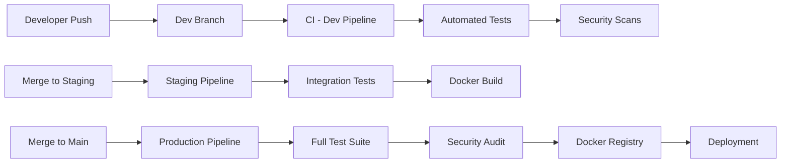

# 🔒 Secure Task Manager

[](https://github.com/MalNko/secure-task-manager/actions/workflows/ci-prod.yml)
[](https://github.com/MalNko/secure-task-manager/actions/workflows/security-scan.yml)
[](https://opensource.org/licenses/MIT)
[](https://dotnet.microsoft.com/)
[](https://reactjs.org/)
[](https://www.docker.com/)

A production-ready task management application showcasing enterprise-level **DevSecOps practices**, automated CI/CD pipelines, comprehensive security scanning, and cloud-native architecture.

## 🌟 Project Highlights

This portfolio project demonstrates:

- ✅ **Complete CI/CD Pipeline** - Automated build, test, and deployment across multiple environments
- ✅ **Security-First Approach** - Integrated vulnerability scanning at every stage
- ✅ **Infrastructure as Code** - Docker containerization with orchestration
- ✅ **Multi-Environment Strategy** - Dev, Staging, and Production workflows
- ✅ **Automated Testing** - Unit and integration tests with code coverage
- ✅ **Cloud-Native Design** - Microservices architecture ready for cloud deployment

---

## 🏗️ Architecture

### System Architecture
```
┌─────────────────────────────────────────────────────────────┐
│                        GitHub Actions                        │
│  ┌──────────┐  ┌──────────┐  ┌──────────┐  ┌──────────┐   │
│  │   Dev    │  │ Staging  │  │   Prod   │  │ Security │   │
│  │ Pipeline │  │ Pipeline │  │ Pipeline │  │ Scanning │   │
│  └──────────┘  └──────────┘  └──────────┘  └──────────┘   │
└─────────────────────────────────────────────────────────────┘
                            │
                            ▼
┌─────────────────────────────────────────────────────────────┐
│                     Docker Containers                        │
│  ┌──────────────┐  ┌──────────────┐  ┌──────────────┐     │
│  │   React UI   │  │  .NET API    │  │  PostgreSQL  │     │
│  │  (Port 3000) │  │ (Port 5000)  │  │  (Port 5432) │     │
│  └──────────────┘  └──────────────┘  └──────────────┘     │
└─────────────────────────────────────────────────────────────┘
```

### Technology Stack

**Backend:**
- .NET 8.0 Web API
- Entity Framework Core
- PostgreSQL Database
- JWT Authentication
- BCrypt Password Hashing

**Frontend:**
- React 18
- Axios for API calls
- Modern CSS styling
- Responsive design

**DevOps & Security:**
- Docker & Docker Compose
- GitHub Actions CI/CD
- Snyk (Dependency scanning)
- Trivy (Container scanning)
- GitLeaks (Secret detection)
- SonarCloud (Code quality)

---

## 🚀 Quick Start

### Prerequisites

- [Docker Desktop](https://www.docker.com/products/docker-desktop)
- [.NET 8.0 SDK](https://dotnet.microsoft.com/download) (for local development)
- [Node.js 18+](https://nodejs.org/) (for local development)

### Running with Docker (Recommended)
```bash
# Clone the repository
git clone https://github.com/MalNko/secure-task-manager.git
cd secure-task-manager

# Start all services
docker-compose -f docker/docker-compose.yml up --build
```

**Access the application:**
- Frontend: http://localhost:3000
- Backend API: http://localhost:5000/swagger
- Health Check: http://localhost:5000/health

### Running Locally

**Backend API:**
```bash
cd src/SecureTaskManager.API
dotnet restore
dotnet run
```

**Frontend:**
```bash
cd src/SecureTaskManager.Web
npm install
npm start
```

**Database:**
```bash
docker-compose -f docker/docker-compose.yml up db
```

---

## 🔐 Security Features

### Automated Security Scanning

Every code push triggers comprehensive security checks:

1. **Secret Scanning** - GitLeaks detects accidentally committed credentials
2. **Dependency Vulnerabilities** - Snyk scans for known CVEs in packages
3. **Container Security** - Trivy scans Docker images for vulnerabilities
4. **Code Quality** - SonarCloud analyzes code for bugs and security hotspots

### Application Security

- 🔒 JWT-based authentication
- 🔒 Bcrypt password hashing
- 🔒 SQL injection protection via parameterized queries
- 🔒 CORS configuration
- 🔒 Security headers (X-Frame-Options, X-Content-Type-Options, etc.)
- 🔒 Rate limiting middleware
- 🔒 Input validation and sanitization

---

## 🔄 CI/CD Pipeline

### Multi-Environment Strategy


### Pipeline Stages

1. **Build** - Compile .NET API and React frontend
2. **Test** - Run unit and integration tests
3. **Security Scan** - Automated vulnerability detection
4. **Docker Build** - Create optimized container images
5. **Deploy** - Automated deployment (when configured)

---

## 📁 Project Structure
```
secure-task-manager/
├── .github/
│   └── workflows/              # GitHub Actions CI/CD pipelines
│       ├── ci-dev.yml         # Development environment
│       ├── ci-staging.yml     # Staging environment
│       ├── ci-prod.yml        # Production environment
│       └── security-scan.yml  # Security scanning
├── src/
│   ├── SecureTaskManager.API/ # .NET Web API
│   │   ├── Controllers/       # API endpoints
│   │   ├── Models/           # Data models
│   │   ├── Data/             # Database context
│   │   └── Program.cs        # Application entry point
│   └── SecureTaskManager.Web/ # React frontend
│       ├── public/
│       └── src/
│           ├── components/    # React components
│           └── services/      # API services
├── tests/
│   └── SecureTaskManager.Tests/ # Unit and integration tests
├── docker/
│   ├── Dockerfile            # API container
│   ├── Dockerfile.web        # Frontend container
│   ├── docker-compose.yml    # Multi-container orchestration
│   └── nginx.conf           # Nginx configuration
└── docs/                     # Additional documentation
```

---

## 🧪 Testing

### Run Tests Locally
```bash
# Run all tests
dotnet test

# Run with coverage
dotnet test /p:CollectCoverage=true /p:CoverageReportsFormat=opencover

# Run specific test project
dotnet test tests/SecureTaskManager.Tests/SecureTaskManager.Tests.csproj
```

### Test Coverage

- Unit tests for controllers and services
- Integration tests for API endpoints
- Frontend component tests (React Testing Library)

---

## 📊 Monitoring & Observability

### Health Checks

- **API Health Endpoint**: `/health`
- **Database Connection**: Verified on startup
- **Swagger Documentation**: `/swagger`

### Logging

- Structured logging with Serilog
- Console and file outputs
- Request/response logging
- Error tracking

---

## 🚢 Deployment

### Docker Deployment

The application is containerized and ready for deployment to:

- AWS ECS/EKS
- Azure Container Instances
- Google Cloud Run
- Any Docker-compatible platform

### Environment Variables
```bash
# API Configuration
ASPNETCORE_ENVIRONMENT=Production
ConnectionStrings__DefaultConnection=<database-connection-string>
Jwt__Key=<your-secret-key>

# Frontend Configuration
REACT_APP_API_URL=<api-url>
```

---

## 🤝 Contributing

This is a portfolio project, but suggestions and feedback are welcome!

1. Fork the repository
2. Create a feature branch (`git checkout -b feature/amazing-feature`)
3. Commit your changes (`git commit -m 'Add amazing feature'`)
4. Push to the branch (`git push origin feature/amazing-feature`)
5. Open a Pull Request

---

## 📝 License

This project is licensed under the MIT License - see the [LICENSE](LICENSE) file for details.

---

## 👨‍💻 Author

**Malusi Thandolwethu Nathan Nkosi**

- LinkedIn: [linkedin.com/in/malusi-nkosi-6995a92b1](https://www.linkedin.com/in/malusi-nkosi-6995a92b1/)
- GitHub: [@MalNko](https://github.com/MalNko)
- Email: malusi.nkosi@icloud.com

---

## 🎯 Learning Outcomes

This project demonstrates proficiency in:

- ✅ Cloud-native application development
- ✅ DevOps & CI/CD pipeline design
- ✅ Security best practices (DevSecOps)
- ✅ Container orchestration
- ✅ Full-stack development (.NET + React)
- ✅ Database design and ORM usage
- ✅ RESTful API design
- ✅ Authentication & authorization
- ✅ Test-driven development
- ✅ Infrastructure as Code

---

## 📚 Documentation

For more detailed documentation, see:

- [API Documentation](docs/API.md) - Endpoint specifications
- [Security Guide](docs/SECURITY.md) - Security practices and compliance
- [Deployment Guide](docs/DEPLOYMENT.md) - Deployment instructions
- [Architecture Decision Records](docs/ADR.md) - Design decisions

---

<div align="center">

**⭐ Star this repository if you find it helpful!**

Made with ❤️ for learning and portfolio demonstration

</div>